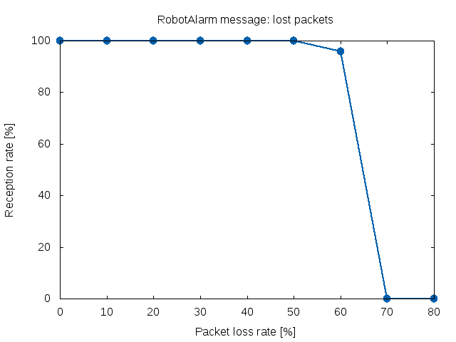
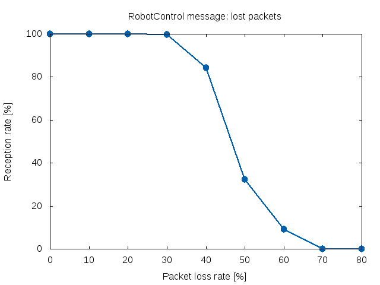
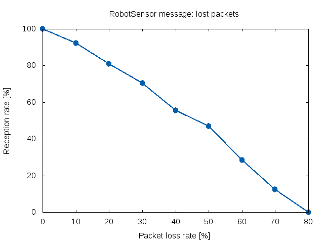

# ROS2 Evaluation

## Introduction

The project provides a benchmarking environment and nodes implementation for testing and evaluation of ROS2, also with comparison to ROS1 and OpenSplice DDS implementation.

The ROS2 evaluation is a part of PIAP tasks in R5-Cop project (http://r5-cop.eu/en/). We aim to create an independent assessment of the current ROS2 state in terms of whether it looks promising, shows some gains on ROS1 already, whether it will be worth migrating to anytime soon, etc.

The project has additional value of providing an example implementation of a simple communication layer based on ROS2 (there is some architecture to it that might fit into some applications, not just a simple main.cpp stuff). The ros2node library might be an useful tool to anyone wanting to implement ROS2 for their robotic applications.

## Installation

#### Install dependencies:

```
    # Ubuntu 16.04
    sudo apt-get install python3-docker docker.io tcpdump gnuplot

    # Ubuntu 14.04
    sudo sh -c "wget -qO- https://get.docker.io/gpg | apt-key add -"
    sudo sh -c "echo deb http://get.docker.io/ubuntu docker main > /etc/apt/sources.list.d/docker.list"
    sudo apt-get update
    sudo apt-get install python3-pip lxc-docker tcpdump gnuplot
    sudo pip3 install docker-py==1.7.2

    # Arch
    pacman -S python-docker-py docker tcpdump gnuplot
```

#### Add your user to the docker group (you need to log out and log in)

```
   sudo usermod -a -G docker $USER
```

#### Install RTI Connext DDS (optional)

You need to obtain a license from RTI and get libraries from https://www.rti.com/. After installation copy the license file to the home directory (e.g. ~/rti_connext_dds-5.2.3) and then copy the home directory to the comm/rti_connext_dds directory, e.g.:

```
    cp rti_license.dat ~/rti_connext_dds-5.2.3
    cp -R ~/rti_connext_dds-5.2.3 ~/ros2_benchmarking/comm/rti_connext_dds
```

#### Build containers:

```
    # If you have RTI Connext DDS
    ./python/run.py --build-all

    # Otherwise
    ./python/run.py --build ros1:base ros1:node ros2:base ros2:opensplice ros2:fastrtps opensplice:base opensplice:node
```

#### Get more help on running tests:

```
    ./python/run.py --help
```
## Sample output

#### Lost packets for RobotAlarm message



#### Lost packets for RobotControl message



#### Lost packets for RobotSensor message



## Authors

The authors of the project are @adamdbrw, @haueck and @ursereg.

## Roadmap 

- Standardize and generate messages between node implementations.
- Add node for FastRTPS
- For higher packet drop rates, manipulate hearbeat parameter and make sure connection is negotiated before measuring


